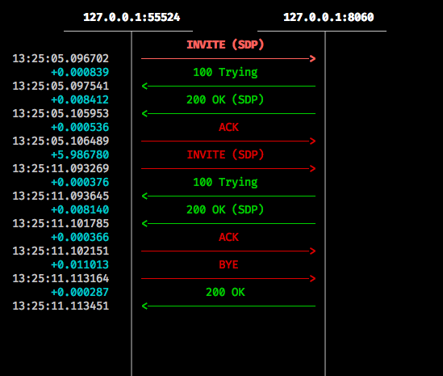

# opensips-mrcp

An MRCP server load balancer using OpenSIPS 2.4.7 (LTS).

## How to run?

### Using pre-built image

`docker pull vernacularai/opensips-mrcp:latest`

`docker run -t --net=host vernacularai/opensips-mrcp`

### Building the image

`docker build . -t opensips-mrcp`

`docker run -t --net=host opensips-mrcp`

OpenSIPS will run on `9060` with both TCP and UDP listeners

## Advanced

### Using the DB

This OpenSIPS LB uses a database engine based on text files. The DB tables are
stored as text files in the [dbtext](dbtext/) directory. You can add default
data in these files and mount it before running like:

`docker run -t --net=host -v dbtext:/usr/src/opensips-2.4.7/ opensips-mrcp`

To know more about the text DB design/syntax, checkout the module doc [here](https://opensips.org/html/docs/modules/2.4.x/db_text.html)

Complete OpenSIPS DB schema can be found [here](https://www.opensips.org/Documentation/Install-DBSchema-2-4)

### Load Balancing

For load balancing we are using the [Load-Balancer](https://opensips.org/html/docs/modules/2.4.x/load_balancer.html) module.

By default, the `load_balancer` table with this docker image will have a SIP server
running at `8060` (default UniMRCP server port) as the only destination available.
You can add the required destination set in the `load_balancer` table.

A must read on Load Balancing using OpenSIPS [https://www.opensips.org/Documentation/Tutorials-LoadBalancing](https://www.opensips.org/Documentation/Tutorials-LoadBalancing)

Check the `load_balancer` default table data [here](dbtext/load_balancer)

## SIP Trace

### Traditional Request/Response trace

### Request/Response trace with Load Balancer

